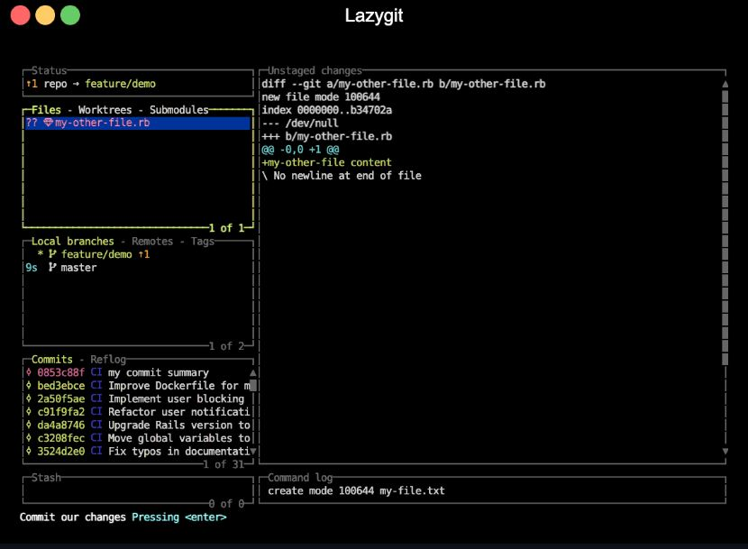
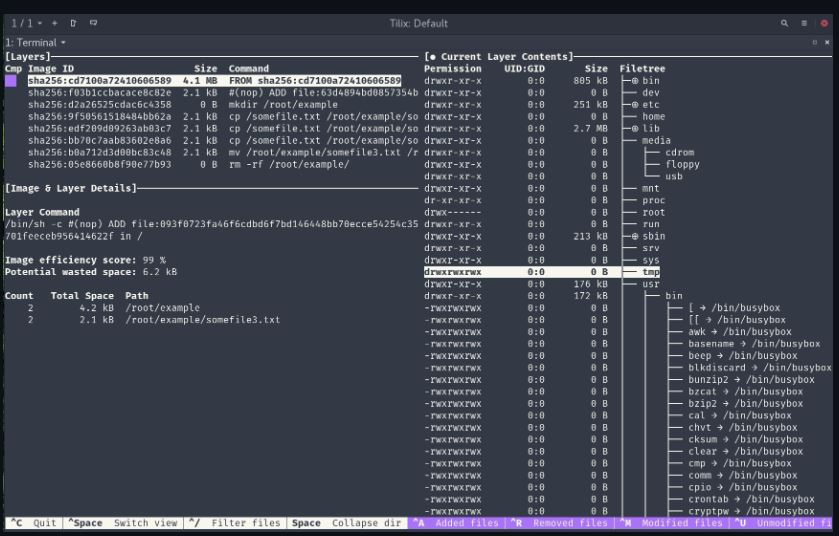

## 2. UX Proof-of-Concept

The CLI must prove technical feasibility, but UX is essential to **bridge to wider adoption**.

- **TUI Option**

  - ncurses-style interface inspired by [`lazygit`](https://github.com/jesseduffield/lazygit) and [`dive`](https://github.com/wagoodman/dive).

  
  

  - Left side bar:
    - Shows sessions
    - commit history
  - Main screen:
    - Split between two windows:
      - Left:
        - Tabs conversation branches
      - Right:
        - Markdown notes from conversation
  - Pop-up windows for:
    - diffs
    - merges
  - Hotkeys for navigation displayed along bottom

- **Electron (or something) Wrapper Option**

  - Lightweight desktop GUI.
  - Wraps CLI commands for less technical users.
  - Mimics a Git-style sidebar with commits, diffs, merge previews.

This PoC demonstrates **market appetite** for non-CLI users while reusing the same backend.
